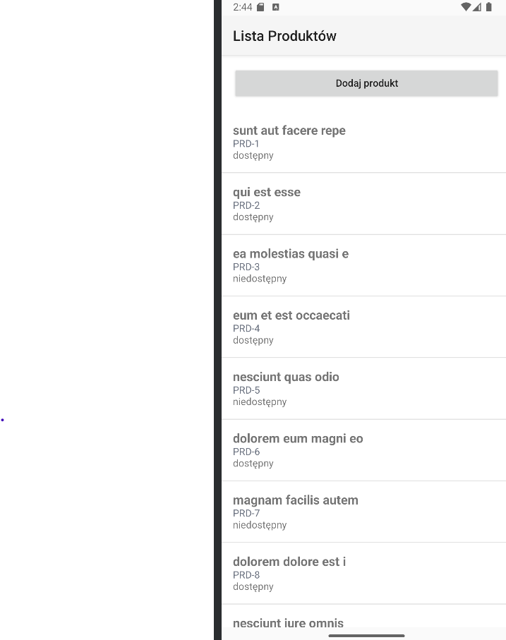
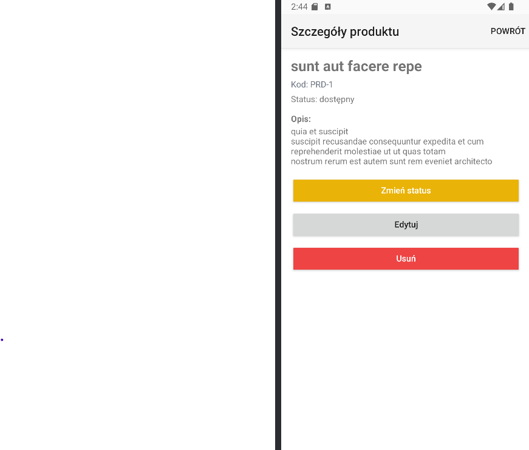
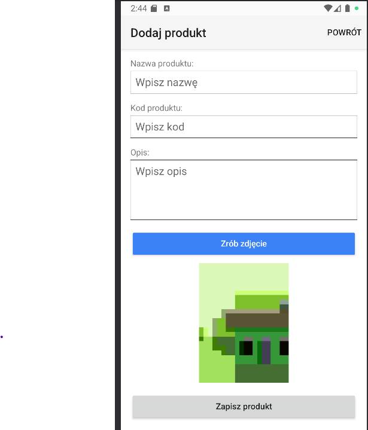
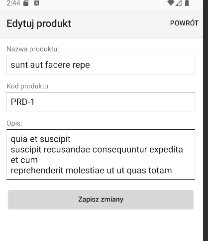

# NativeScript: Scan Inventory

## Cel
Zbuduj podstawową aplikację w **NativeScript używając framework Angular**, która używa **natywnej funkcji** oraz **komunikuje się z API**, z **3–4 widokami**.

## Zakres i wymagania funkcjonalne
- **Natywna funkcja (min. 1):** wybierz i uzasadnij (np. aparat/kamera – skan/zdjęcie, pliki, geolokalizacja, latarka, wibracje).
- **API (min. 1 endpoint):** pobranie listy elementów lub zapis nowego.
- **Widoki (3–4):**
  1. **Lista produktów** (nazwa, kod, mini-status).
  2. **Szczegóły produktu** (opis, zdjęcie/skan, akcje: usuń/edytuj).
  3. **Dodaj produkt** (formularz + akcja natywna, np. „zeskanuj/zdjęcie”).
  4. *(Opcjonalnie)* **Ustawienia** (np. preferencje, tryb offline).
- **Walidacja:** minimalna w formularzu (np. wymagane pola).

## Testowanie lokalne (w trakcie developmentu)
- Uruchom na **urządzeniu/emulatorze**.
- Pokaż: dodanie produktu z użyciem **natywnej funkcji** (np. zdjęcie/skan), pojawienie się na liście.
- Pokaż komunikację z **API** (pobranie/zapis) i zachowanie przy błędach/uprawnieniach.

## Definition of Done (DoD)
- [x] 3–4 widoki + nawigacja.
- [x] Co najmniej 1 **natywna funkcja**.
- [x] Integracja z **API** (GET/POST).
- [x] Walidacja formularza + podstawowa obsługa błędów.
- [x] Aktualizacja `README.md`, zrzuty ekranów, min. 3 commity.

---

## Opis implementacji

### Widoki
Aplikacja posiada 4 widoki:
1. **Lista produktów** - wyświetla produkty z nazwą, kodem i statusem dostępności
2. **Szczegóły produktu** - pokazuje pełne informacje o produkcie, pozwala usunąć, edytować i zmienić status
3. **Dodaj produkt** - formularz do dodawania nowego produktu ze zdjęciem
4. **Edytuj produkt** - formularz do edycji istniejącego produktu

### Natywna funkcja - Kamera
Do robienia zdjęć produktów użyto biblioteki `@nativescript/camera`. Pozwala ona na:
- Pobranie uprawnień do kamery (`requestCameraPermissions`)
- Zrobienie zdjęcia (`takePicture`)

### API
Aplikacja komunikuje się z API `https://jsonplaceholder.typicode.com`:
- **GET** `/posts?_limit=10` - pobieranie listy produktów
- **POST** `/posts` - dodawanie nowego produktu
- **PUT** `/posts/:id` - aktualizacja produktu
- **DELETE** `/posts/:id` - usuwanie produktu

Do komunikacji z API użyto `HttpClient` z `@angular/common/http`.

### Walidacja
Formularze posiadają walidację wymaganych pól:
- Nazwa produktu - wymagana
- Kod produktu - wymagany przy dodawaniu

## Zdjęcia:

- Lista produktów

- Szczegóły produktu

- Dodawanie produktu

- Edytowanie produktu

